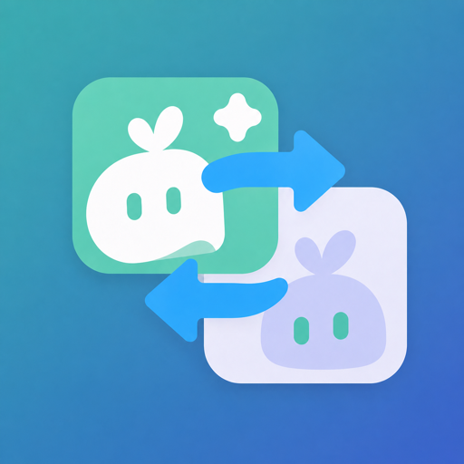
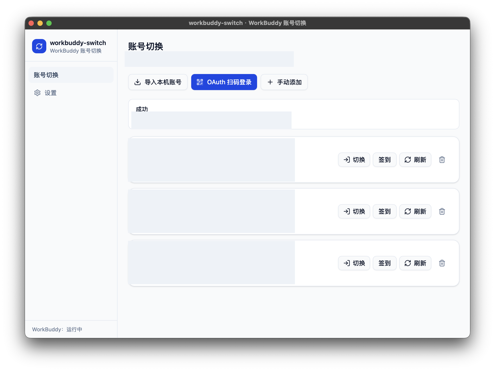
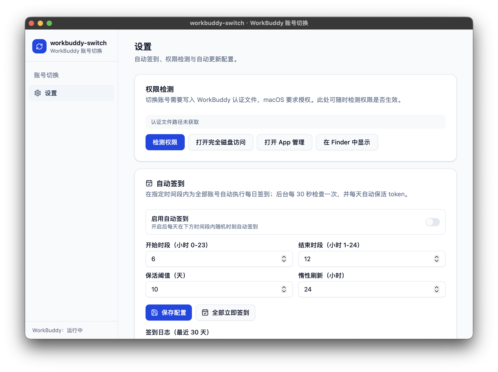

# workbuddy-switch

WorkBuddy（腾讯 AI 编程助手）账号切换工具。两种形态：

- **桌面 App**：下载 `.app` 双击运行（Tauri，推荐日常使用）
- **npm / webui**：`npm i -g workbuddy-switch` 后运行 `workbuddy-switch`，浏览器打开操作界面

多账号共享登录态（`workbuddy-desktop.info`），一键切换 WorkBuddy 登录账号，并支持将当前账号的会话复制给目标账号（云端归属目标）。

<p align="center">
  
</p>

<p align="center">
  <strong>workbuddy-switch</strong><br />
  WorkBuddy 多账号切换工具
</p>

## 快速开始

### npm 安装（webui）

```bash
npm i -g workbuddy-switch
workbuddy-switch              # 启动本地服务 + 自动打开浏览器
workbuddy-switch status       # 终端查看当前账号
```

webui 界面与桌面 App 一致：账号管理、切换、会话复制、自动签到、token 保活、更新检查。

### 桌面 App

从 GitHub Releases 下载对应平台 `.app`（macOS）双击运行。

> **macOS 提示「已损坏，无法打开」？** 未签名应用会触发隔离机制，在终端执行一次即可：
>
> ```bash
> xattr -rd com.apple.quarantine "/Applications/workbuddy-switch.app"
> ```

## 功能

| 模块 | 说明 |
| --- | --- |
| 账号管理 | OAuth 扫码登录、从本机导入、手动添加 token、删除账号 |
| 账号切换 | 备份认证文件 → 关闭 WorkBuddy → 写入目标账号 → 重启，切换过程实时进度反馈 |
| 会话复制 | 将当前账号勾选的会话以新 id 复制给目标账号（jsonl 正文 + `workbuddy.db` 索引 + edge-sync 注册） |
| 自动签到 | 每日在配置时间段内随机时刻签到；一键全部签到；30 天签到日志 |
| Token 保活 | 惰性刷新（操作前不足阈值刷新）+ 每日保活（默认每天无条件刷新一次，阈值 >0 时仅刷新剩余不足该天数的账号），避免 refresh token 过期 |
| 积分到期查询 | 自动查询每个账号的 WorkBuddy 积分资源、剩余量和到期时间；7 天内到期高亮并按到期优先排序 |
| CodeBuddy CLI | 与 WorkBuddy 复用同一账号库，但当前账号独立；账号卡片可单独切 CLI，7 天内到期积分优先并按最近到期时间排序；支持自动轮换（按积分紧迫度自动切换，见下） |
| 自动轮换 | 后台定时把 CodeBuddy CLI 切到积分最紧迫（最早到期）的账号；结合活跃保护、冷却期、到期差异阈值防抖，避免无效切换浪费缓存 |
| 自动更新 | 配置 GitHub Releases 源检查新版本；整包更新经签名校验（tauri-updater） |
| 权限检测 | macOS 授权引导（App 管理 / 完全磁盘访问拖拽授权 + 自动检测） |

## 使用

1. **添加账号**：账号页 →「扫码登录」（OAuth device flow）或「从本机导入」「手动添加」
2. **切换账号**：账号卡片 →「切换」，可勾选复制当前会话
3. **自动签到**：设置 → 自动签到，开启并配置时间段
4. **查看积分到期**：账号页会自动查询各账号积分资源；点击「刷新积分」可手动更新，临近到期的资源会高亮，并把快过期账号按最近到期时间排序，最前面的标记为「建议优先使用」
5. **CodeBuddy CLI**：账号页可一键接入/升级 helper（等价于在 `~/.codebuddy/settings.json` 配置 `apiKeyHelper`）；CodeBuddy CLI 与 WorkBuddy 当前账号相互独立，「切换 CodeBuddy」只更新 CLI 轮换状态，不重启 WorkBuddy。CLI 的 helper 缓存通常需要等待约 30 秒刷新。
6. **自动轮换**：设置 → CodeBuddy CLI 自动轮换，开启后后台按间隔检查并把 CLI 切到积分最紧迫的账号（策略见下）
7. **更新**：应用会自动检查公开 GitHub Releases；发现新版本后可在左下角直接升级，也可从设置页打开 Release 页面手动下载。

## 界面截图

### 账号切换

账号页支持 OAuth 扫码登录、导入本机账号、手动添加，以及对每个账号执行切换、签到和 token 刷新。

<p align="center">
  
</p>

### 设置

设置页集中管理 macOS 权限检测、自动签到、Token 保活和自动更新。

<p align="center">
  
</p>

> 文档截图中的账号名称、头像首字、UID、当前登录名和状态信息均已做脱敏处理。

### 自动轮换策略

自动轮换的目标是防止积分过期浪费：后台定时查询所有账号的积分到期情况，把 CodeBuddy CLI 切到「最紧迫」的账号（最早到期且仍有剩余积分）。为避免无效切换浪费缓存，每次检查按以下顺序决策：

1. **有效账号**：查询成功、未过期、有剩余积分的账号才可被选为目标
2. **紧迫度检查**：所有账号到期都还早（最紧迫的剩余超过 `min_urgency_hours`，默认 72 小时）→ 不切
3. **已是目标**：当前 CLI 账号就是最紧迫账号 → 不切
4. **冷却期**：切换后 `cooldown_minutes`（默认 120）内不重复切
5. **活跃保护**：最近 `active_guard_minutes`（默认 30）内 CLI 会话有写入（正在对话）→ 不切
6. **价值过滤**：目标账号剩余积分低于 `min_remaining_credits` → 不值得切（默认 0 关闭；每次检查会把各账号剩余积分写入日志，可据此调整）
7. **防抖动**：目标比当前早到期但差异小于 `min_gap_hours`（默认 24）→ 不切

> **为什么这么保守**：实测 CodeBuddy 服务端 prompt 缓存按「账号 + 会话」维度缓存（TTL ≥ 10 小时），切换账号会让当前会话的缓存失效一轮（约一次完整对话上下文的计费），因此切换频率越低越好，且尽量避开正在进行的对话。

配置项：`check_interval_minutes`（检查间隔，默认 5）、`cooldown_minutes`、`min_urgency_hours`、`active_guard_minutes`、`min_remaining_credits`、`min_gap_hours`。可在设置页调整，或直接编辑 `~/.wb-switch/auto_rotate_config.json`。

### macOS 权限说明

切换账号需要写入 WorkBuddy 认证文件，macOS 要求授权「App 管理」（或「完全磁盘访问」）：

1. 首次切换报「无权限」时，点「打开系统设置」
2. 优先在 **App 管理** 里打开 workbuddy-switch 开关；若没有，则去 **完全磁盘访问** 把 workbuddy-switch 拖进带箭头的框
3. 授权后重启本应用生效；设置页「权限检测」可随时验证

> webui 模式：由启动服务的终端进程权限决定；若终端已授权完全磁盘访问则无需额外操作。

## 致谢

感谢 [Linux.do](https://linux.do) 社区。

## 许可

[MIT](./LICENSE)
